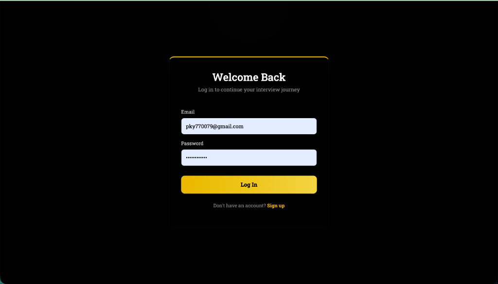
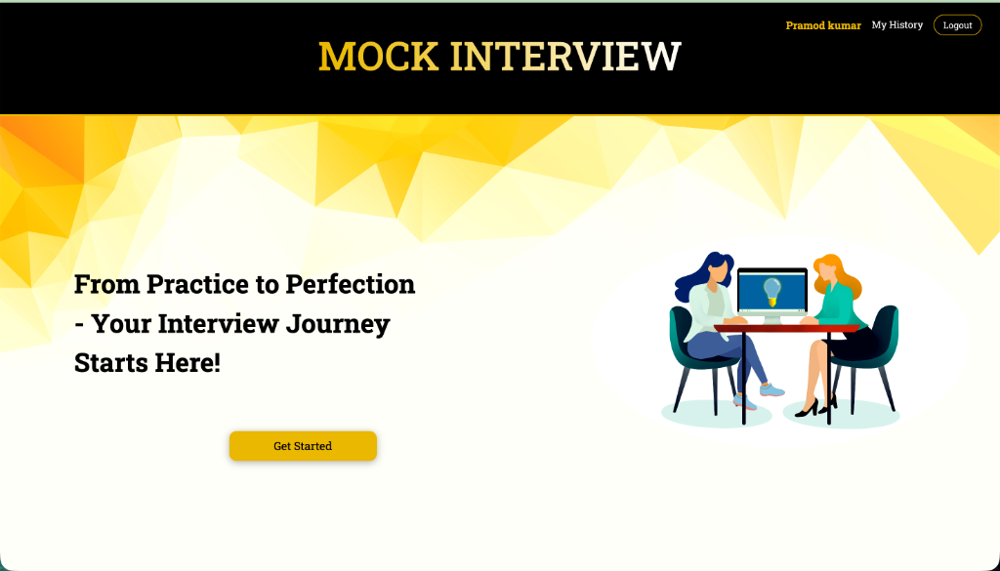
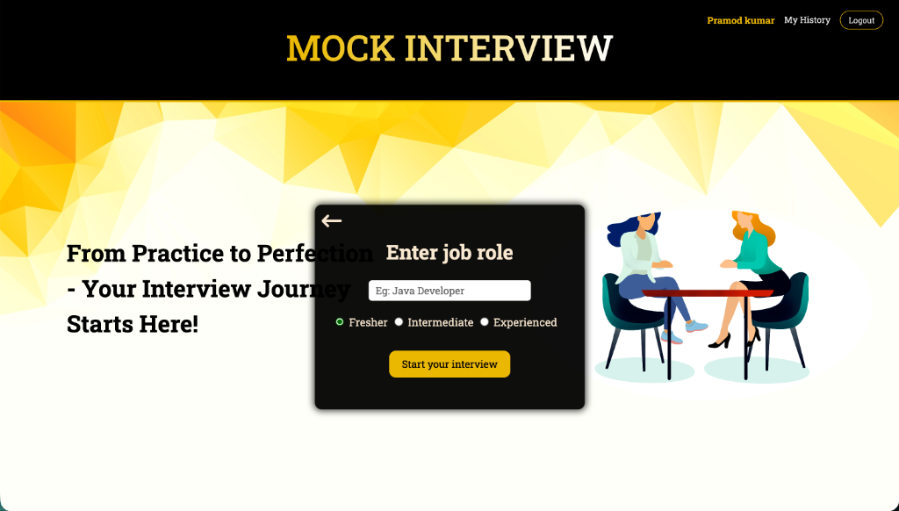
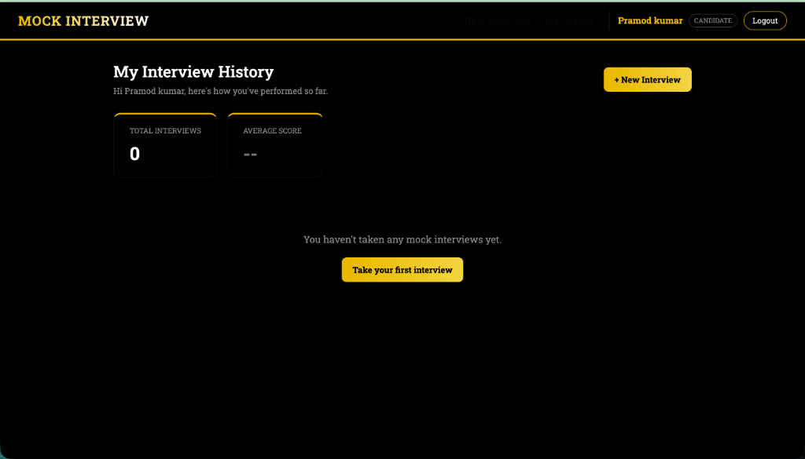

##  Mock Interview System

## Visit at https://mock-interview-system-python.vercel.app/

### Note : Due to API limitations, this application only functions properly on the latest browsers such as Google Chrome, Microsoft Edge, etc.
### Recomended : Google Chrome, Desktop Environment.

## Software Features
* Front End : React
* Back End : Python - Flask
* Generate questions based on input using AI ( gemini ).
* No of face detections for cheat analysis.
* Emotion analysis.
* Speech recognition for answering questions.
* AI ( gemini ) generated review based on interview performance including emotion and cheat analysis.
* Responsive Design.

## Preview
### Desktop version
#### Login Page

#### Landing Page

#### Job-Title Input

#### Interview Page

#### Review Page

#### My Interview History

### Mobile Version
